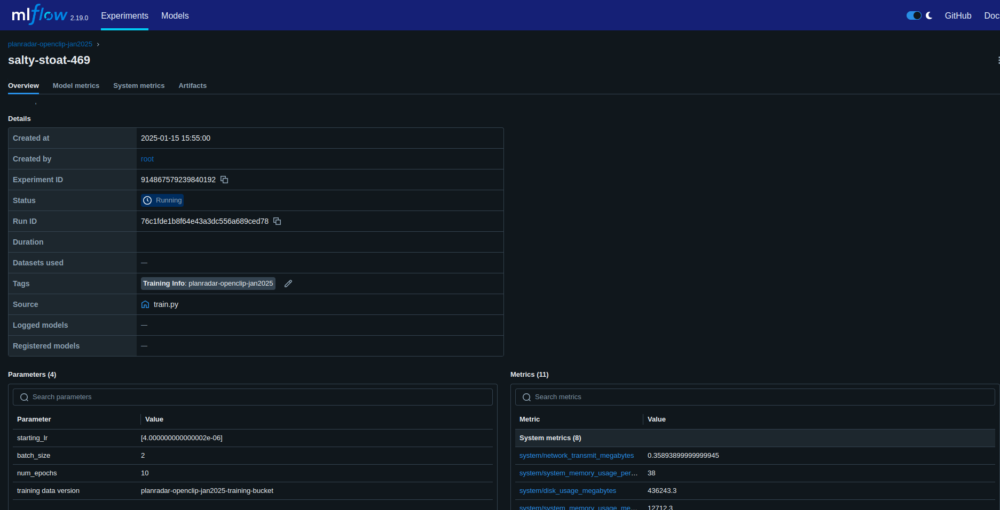
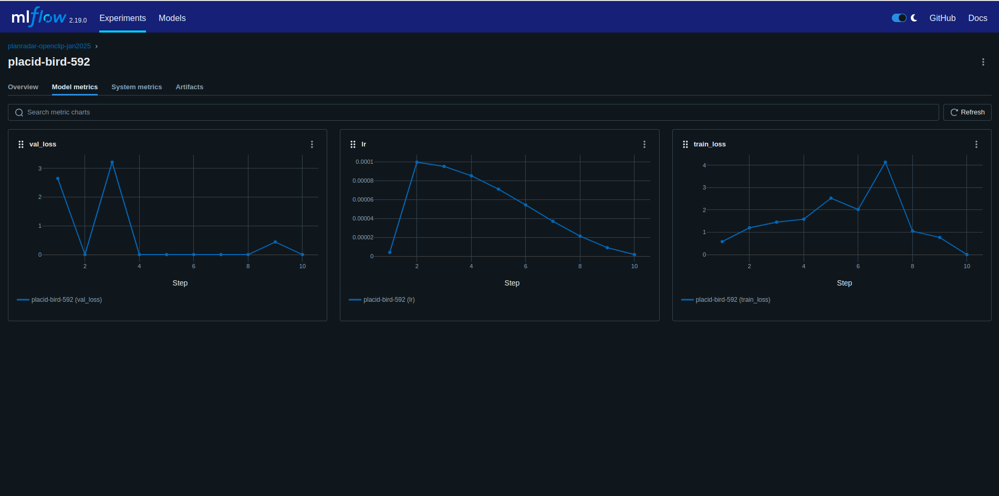
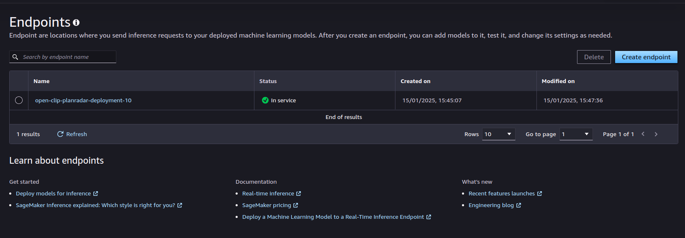
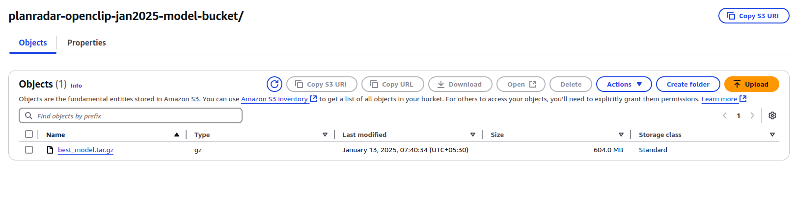

## OpenClip Train-Inference-Deploy ##

##### The repo has two sub-dirs in following structure #####

```
openclip-train-inference-deploy/
  -openclip-docker-training/
      --README.md
      -- Dockerfile
      -- train.py
  -openclip-docker-inference/
      --README.md
      -- Dockerfile (for sagemaker use only)
      -- sagemaker_inference.py
      -- lambda_inference.py
```


#### openclip-docker-training focuses on remote(EC2) / local training, logging,metrics monitoring, model storage , notifications ####
#### openclip-docker-inference focuses on deploying trained model on AWS Sagemaker endpoint & invoke it via REST API & AWS Lambda ####
#### For simply testing the model without AWS credentials, run below cmd to invoke Sagemaker endpoint via REST API & AWS Lambda ####
```
$cd openclip-docker-inference
$python3 lambda_inference.py
```
#### Note: The configured Sagemaker endpoint for Lambda inference might be turned off for cost $$ reasons , Kindly email vignesh.kotteeswaran@gmail.com before testing ###


### Logging Model metrics ###




### Deploying in AWS Sagemaker endpoint ###


### Model storing & versioning in S3 ###


### Training notifications / warning via AWS SNS email publish ###


### ToDo ###

#### For a production ready model, I would try to generate synthetic data of images & description based on client's actual data ####
#### and train on a better GPU EC2 instance to get better embeddings & better cosine similarity score ####
