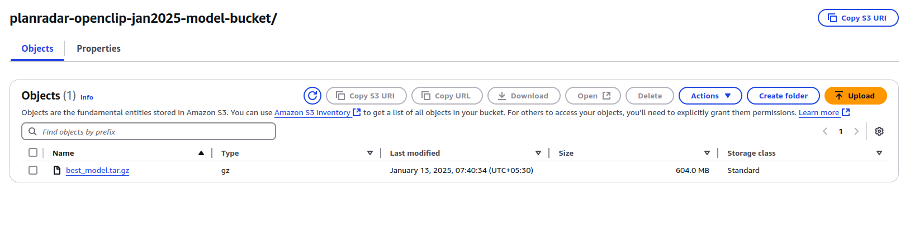

## OpenClip Train-Inference-Deploy ##

##### The repo has two sub-dirs in following structure #####

```
openclip-train-inference-deploy/
  -openclip-docker-training/
      --README.md
      -- Dockerfile
      -- train.py
  -openclip-docker-inference/
      --README.md
      -- Dockerfile (for sagemaker use only)
      -- sagemaker_inference.py
```


#### openclip-docker-training focuses on remote / local training, logging,metrics monitoring, model storage , notifications ####
#### openclip-docker-inference focuses on deploying trained model on AWS Sagemaker endpoint  ####

### Logging Model metrics ###


### Deploying in AWS Sagemaker endpoint ###


### Model storing & versioning in S3 ###


### Training notifications / warning via AWS SNS email publish ###


